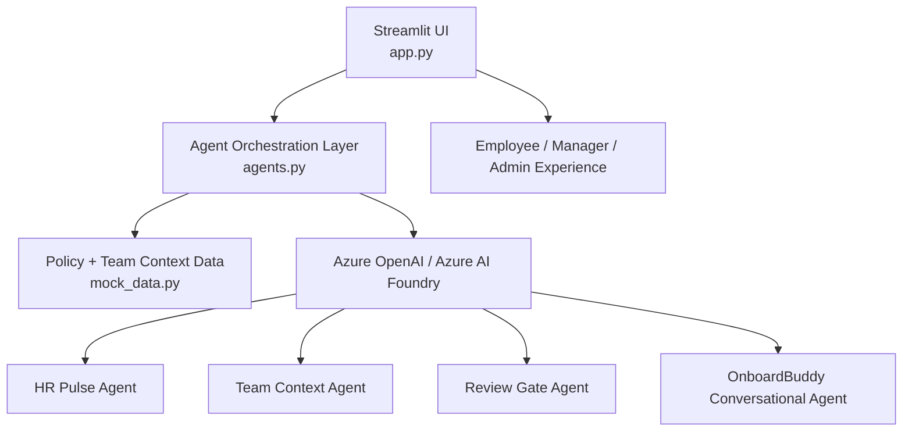

# OnboardIQ Workspace 🚀

**OnboardIQ** accelerates enterprise onboarding from weeks to hours using an autonomous multi-agent platform built around Azure AI Foundry and Microsoft IQ.

---

## Why OnboardIQ?

Enterprise onboarding is costly, manual, and error-prone. New hires often struggle to understand internal policies, team workflows, and role-specific expectations without intensive manager supervision.

OnboardIQ solves this problem with a specialized agent-driven onboarding assistant that delivers:

- Policy-grounded compliance guidance
- Team-specific onboarding roadmaps
- Risk-aware submission auditing
- Conversational task support

This project is built as a strong **Enterprise Agents** submission for the Microsoft Agents League, with a layered reasoning architecture that fits Microsoft IQ and Azure Foundry patterns.

---

## Core Features

- **Enterprise Agent Workflow**: Four specialized agents work together to onboard employees, support managers, and empower HR.
- **Azure AI Foundry Integration**: Uses Azure OpenAI via the `openai` Python SDK with strong grounding in corporate policy and team context.
- **Business-focused UX**: Tailored dashboards for employees, managers, and HR admins.
- **Accessibility and Localization**: Supports high contrast, font scaling, and six languages.
- **Simulation Data Driven**: Uses realistic onboarding policy and team context seed data for enterprise scenarios.

---

## How It Works

OnboardIQ is composed of a Streamlit UI front end and a dedicated agent orchestration layer.

- `app.py` renders the interactive UI, manages state, and triggers agents based on role and user actions.
- `agents.py` sends prompts to Azure OpenAI and implements the logic for each onboarding agent.
- `mock_data.py` provides the enterprise policy and team context grounding information.
- `test_azure.py` validates Azure OpenAI configuration and connectivity.

### Agent Mapping

- **HR Pulse Agent** → `run_hr_pulse_agent()`
- **Team Context Agent** → `run_team_context_agent()`
- **Review Gate Agent** → `run_review_gate_agent()`
- **OnboardBuddy** → `run_conversational_buddy_agent()`

Each agent is designed around a clear enterprise use case and maps directly to the contest problem statement.

---

## Architecture Diagram



> If your markdown viewer does not render Mermaid diagrams, copy this block into a Mermaid live editor at https://mermaid.live/.

---

## Contest Fit

- **Primary challenge:** Enterprise Agents
- **Secondary strength:** Reasoning Agents architecture
- **Problem solved:** Slow, risky enterprise onboarding and policy alignment
- **Value:** Faster new-hire ramp-up, stronger compliance, and reduced manager workload

---

## Setup & Run

1. Clone the repository:
   ```bash
   git clone https://github.com/sprasad-io/onboard-iq.git
   cd onboard-iq
   ```
2. Install dependencies:
   ```bash
   pip install -r requirements.txt
   ```
3. Create a `.env` file with your Azure OpenAI credentials:
   ```text
   AZURE_OPENAI_KEY="<your-key>"
   AZURE_OPENAI_ENDPOINT="https://<your-resource>.openai.azure.com"
   AZURE_OPENAI_DEPLOYMENT_NAME="gpt-4o-mini"
   ```
4. Launch the app:
   ```bash
   python -m streamlit run app.py
   ```

---

## Demo Flow

1. Authenticate as an employee or manager.
2. Use **HR Pulse** to generate grounded policy guidance.
3. Use **Team Context** to create a role-specific onboarding roadmap.
4. Use **Review Gate** to audit a sample task submission.
5. Use **OnboardBuddy** to ask onboarding questions and commit task updates.
6. Switch to HR admin mode to edit policies and demonstrate live grounding.

---

## File Summary

- `app.py` — Streamlit UI and role-based onboarding dashboard
- `agents.py` — Multi-agent orchestration and Azure OpenAI integration
- `mock_data.py` — Policy and team context seed data
- `test_azure.py` — Azure environment connectivity diagnostic
- `requirements.txt` — Python dependencies

---

## Submission Notes

**Project title:** OnboardIQ — Autonomous Enterprise Onboarding Agent

**Tagline:** Accelerating enterprise onboarding from weeks to hours with Azure AI Foundry and Microsoft IQ.

**Why this wins:** It is a business-ready, enterprise-focused agent app that applies secure reasoning and grounded policy automation to real onboarding challenges.

---

## Contest Entry Summary (Copy/Paste)

**Challenge:** Enterprise Agents

**Project Summary:** OnboardIQ solves the slow, manual, and high-risk process of enterprise onboarding. It uses a secure multi-agent framework built on Azure AI Foundry and Microsoft IQ to deliver policy-grounded compliance summaries, team-specific onboarding roadmaps, risk-aware submission auditing, and conversational task guidance.

**How it works:** The app is a Streamlit dashboard where employees, managers, and admins interact with four specialized agents. `HR Pulse` grounds compliance in company policy, `Team Context` builds a 30-day onboarding roadmap, `Review Gate` audits submissions and returns a confidence score, and `OnboardBuddy` provides task-oriented chat support.

**Demo focus:** Show login as an employee, run HR Pulse, run Team Context, audit a sample submission with Review Gate, chat with OnboardBuddy, and edit policies live as admin.

---

## Recommended Website Description

> OnboardIQ solves the slow, manual, and high-risk process of enterprise onboarding. It uses a secure multi-agent framework built on Azure AI Foundry and Microsoft IQ to deliver compliance-grounded policy summaries, team-specific onboarding roadmaps, automated risk auditing, and conversational task guidance.

This README is now crafted to be judge-friendly, developer-friendly, and contest-ready.
